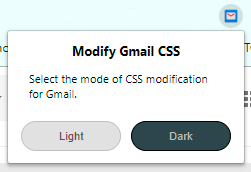
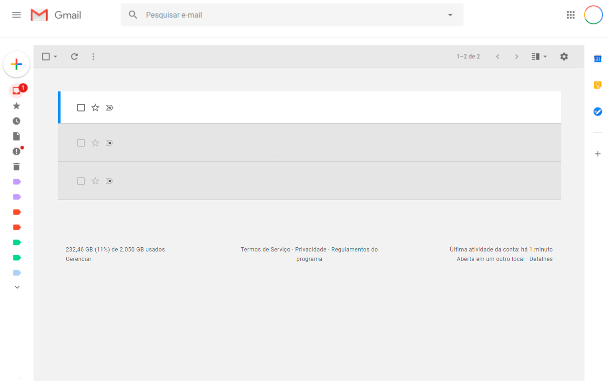
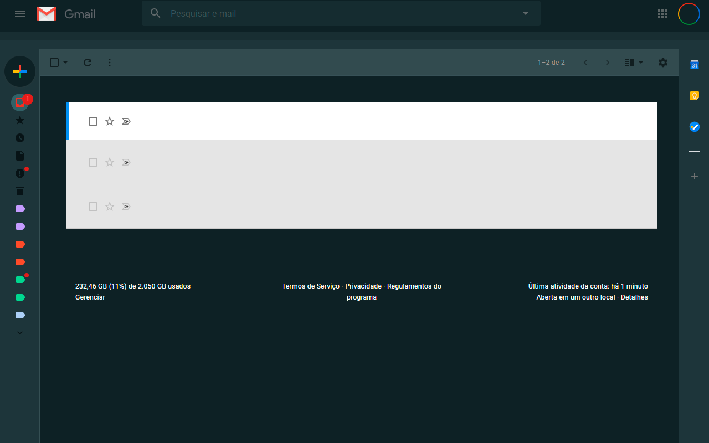

# Gmail visual change extension

This extension just change Gmail css to appear like Google Inbox.

To download you can access [Chrome Web Store](https://chrome.google.com/webstore/detail/modify-gmail-css/bfijmnifafbaiionejangopoppmpiimi)

## Change Layout

You can choose between two layouts, Light mode and Dark mode.
Click on Extension's icon and select which mode do you want.

## Screenshot

### Light Mode

### Dark Mode

